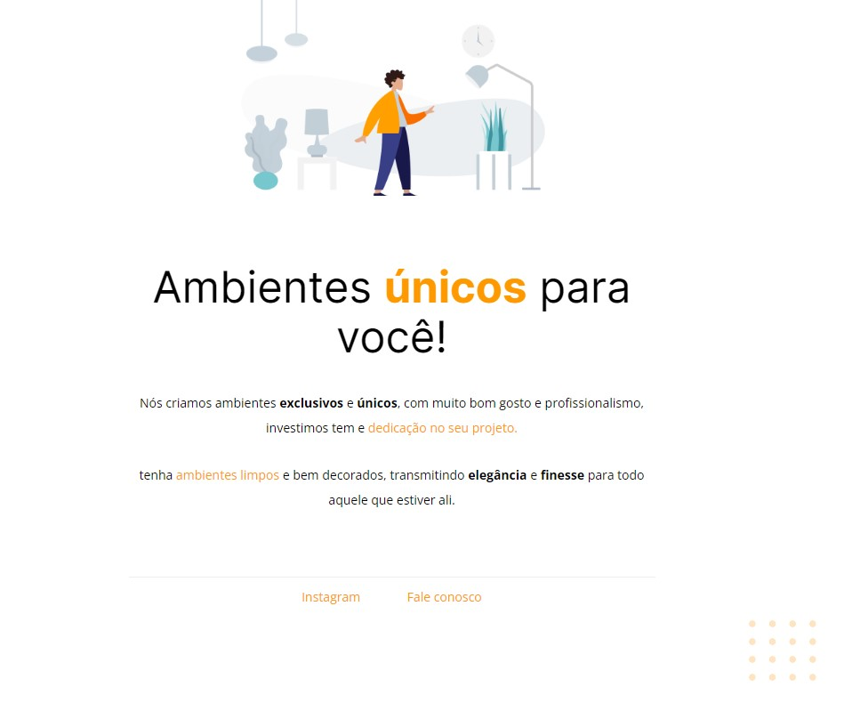

# Corrigindo Bugs

  

# 💻 Projeto
 A proposta deste desafio foi pegar um código pronto com os elementos fora do lugar e organiza-los de acordo com o desafio anterior. Ótimo exercício para treinar a leitura de código alheio.

 O desafio se encontra no link abaixo:
<ul>
    <li><a href="#" target="_blank" style="color: white;">Corrigindo Bugs</a>

</ul>

 

# 🚀 Tecnologias

<ul>
    <li>FIGMA</li>
    <li>HTML</li>
    <li>CSS</li>
</ul>

 

# 🤝 Contribuições
 
Contribuições são bem-vindas! Sinta-se à vontade para abrir uma issue para relatar problemas ou sugerir melhorias.

 
 

# 📝 Licença

Este projeto está sob a licença MIT

