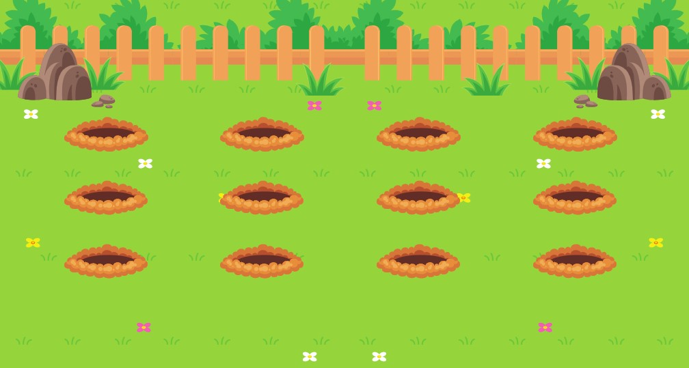

# Jardim das touperas
<h2 align="center">
 </h2>
 

# 💻 Projeto

Desafio proposto pela Rocketseat. A ideia é trabalhar as técnicas de animação do CSS

O projeto pode ser acessado pelo link abaixo:
<ul>
    <li><a href="#" target="_blank" style="color: white;">Jardim das toupeiras</a>

</ul>

  

# 🚀 Tecnologias

<ul>
    <li>FIGMA</li>
    <li>HTML</li>
    <li>CSS</li>
</ul>

 

# 🤝 Contribuições
 
Contribuições são bem-vindas! Sinta-se à vontade para abrir uma issue para relatar problemas ou sugerir melhorias.
