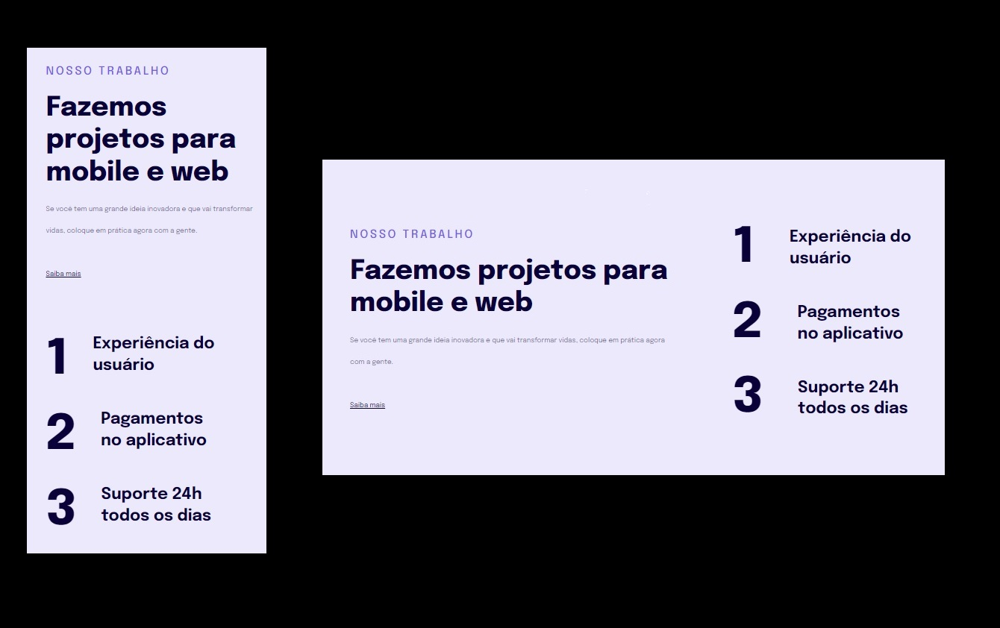

# Responsividade

  

# 💻 Projeto

Primeiro projeto responsivo do Bootcamp. Página feita com técnicas básicas de responsividade utilizando medidas flexívieis e Media Query.

O projeto pode ser acessado pelo lnk abaixo:

<ul>
    <li><a href="https://devaugustow.github.io/rocketseat_explorer/stage_03/responsividade/index.html" target="_blank" style="color: white;">Primeiro Projeto Responsivo</a>

</ul>

  

# 🚀 Tecnologias

<ul>
    <li>FIGMA</li>
    <li>HTML</li>
    <li>CSS</li>
</ul>

 

# 🤝 Contribuições
 
Contribuições são bem-vindas! Sinta-se à vontade para abrir uma issue para relatar problemas ou sugerir melhorias.

